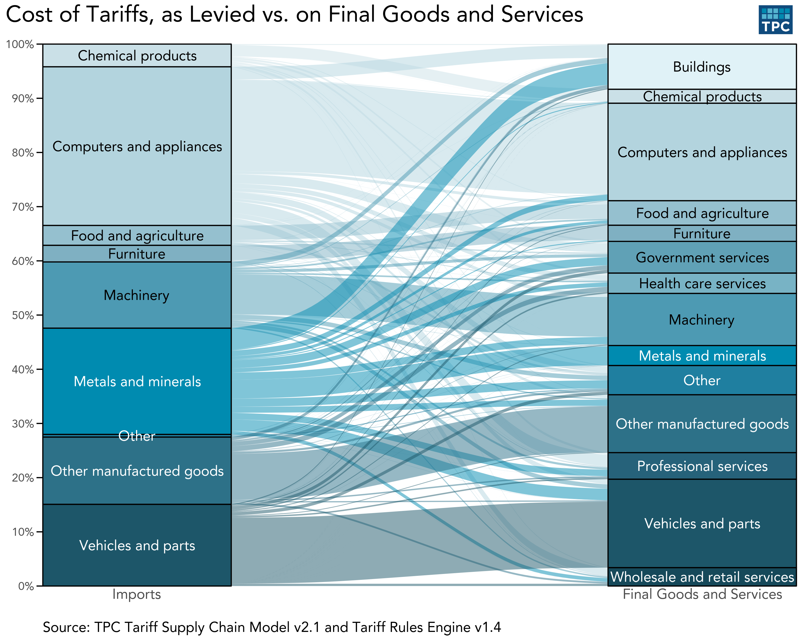

\textcolor{gray}{March 2026}

As tariffs have re-emerged as a central feature of US economic policy, the Urban-Brookings Tax Policy Center (TPC) has developed rigorous models to assess how they affect federal revenues, businesses, and households - and how these effects play out across national, regional, and local economies. Our team is equipped to help decision-makers assess the impacts of tariffs on jobs and economic activity in their communities (by county and metropolitan statistical area, as well as by specific industry).

## How Our Model Works

TPC's tariff models have several unique capabilities:

- **Detailed tariff rates** — Computes detailed tariff rates on each product from each country, by the day.
- **Supply chain tracing** — Traces tariffs from intermediate imports, such as steel, to US-produced goods like automobiles and buildings.
- **Household-level impact** — Models the impacts of tariffs, and any remedial policies, on families by income and demographics, using hundreds of thousands of tax records.

\vspace{1em}

{width=100%}

## What We Can Produce

TPC can produce tariff impact estimates tailored to your county or metropolitan statistical area.

- **Industry-level analysis** — Measure tariff impact across industries; estimate changes in output, employment, earnings, and value-added driven by tariffs on imported inputs.
- **Government cost impact** — Quantify how tariffs raise procurement costs for local governments, including construction materials, vehicles, and equipment.

## What We Have Found

- Construction costs are up one percent due to tariffs.
- Consumer automobile prices are 5.6 percent higher under current tariffs.
- Tariffs act like a flat tax, adding one percentage point to tax rates at every income level.
- Under current tariffs, including Section 122, more than 6 percent of tariff costs fall on state and local governments.

## Our Models

::: {.box-deepblue}
### Tariff Rules Engine
Determines the tariff rate on each import, which requires sophisticated modeling because of complex exemptions and ever-changing policies.
:::

::: {.box-teal}
### Tariff Revenue Model
Estimates how much buyers will reduce their demand for imports, which affects the amount of tariffs paid.
:::

::: {.box-deepblue}
### Supply Chain Model
Determines which industries end up paying these tariffs based on input-output data on what inputs each industry uses.
:::

::: {.box-teal}
### Microsimulation Model
Analyzes impact at the household level, using detailed consumption and income data based on more than 200,000 tax records.
:::

Please contact Robert McClelland (rmcclelland@urban.org), Thomas Brosy (tbrosy@urban.org), and John Wong\
(jwong@urban.org) with inquiries about TPC's tariff models.

\vspace{1em}

::: {.content-visible when-format="pdf"}
```{=latex}
\begin{center}
\begin{minipage}{0.45\textwidth}
\centering
\includegraphics[width=1.5in]{qr/qrcode_tarifftracker.png}\\
TPC Tariff Tracker
\end{minipage}
\hfill
\begin{minipage}{0.45\textwidth}
\centering
\includegraphics[width=1.5in]{qr/qrcode_SLF.png}\\
TPC's Work on State and Local Finance
\end{minipage}
\end{center}
```
:::

::: {.content-visible when-format="html"}
:::: {.columns .qr-codes}
::: {.column width="50%"}
{width=1.5in}
:::

::: {.column width="50%"}
{width=1.5in}
:::
::::
:::
